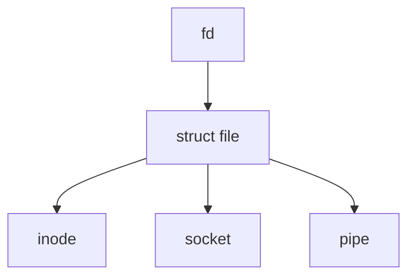
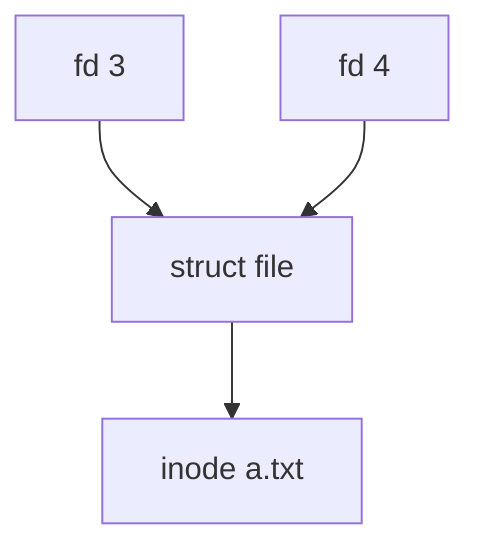
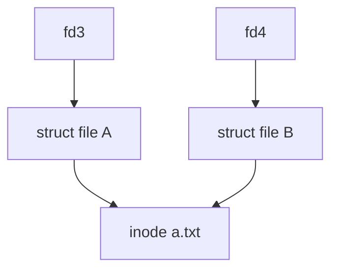
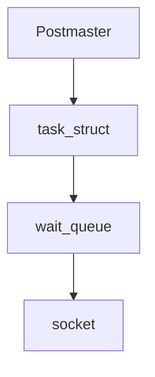
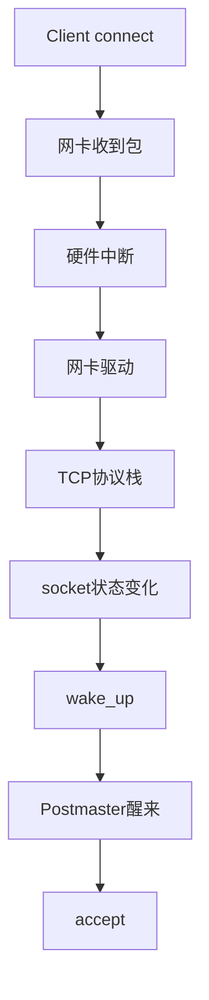
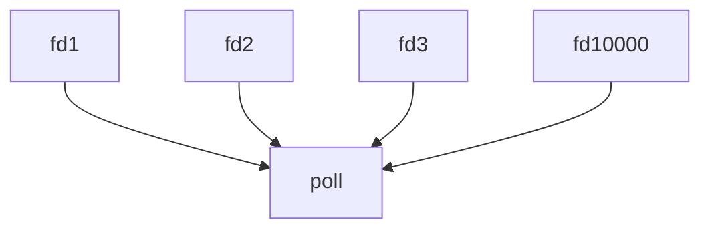
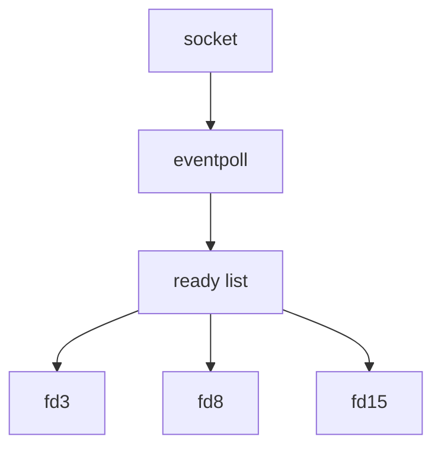
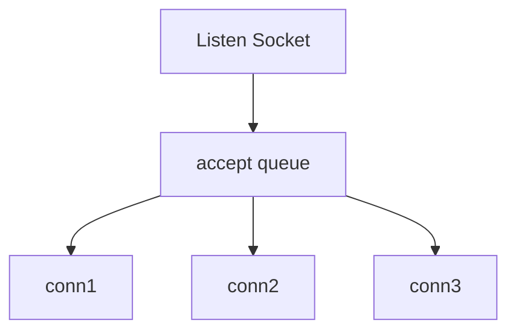
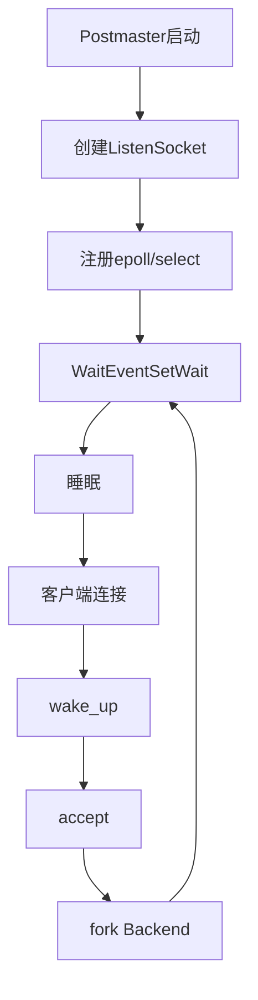
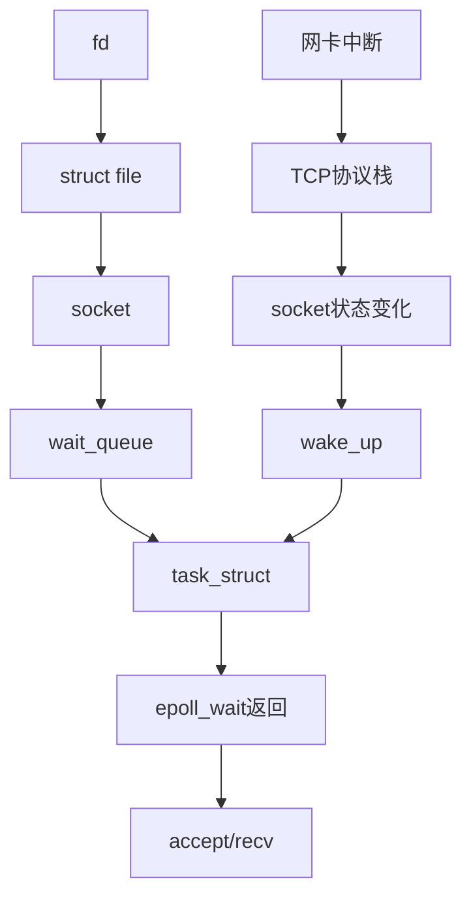

# Linux 编程基础

## 1. fd（File Descriptor）本质是什么

```c
int fd = open("test.txt", O_RDONLY);
```

fd 不是文件本身。

fd（File Descriptor）本质上是：

```text
进程 fd 表（文件描述符表）中的数组下标
```

可以理解成：

```c
struct file *fdtable[1024];
```

例如：

```text
fdtable

[0] -> stdin
[1] -> stdout
[2] -> stderr
[3] -> socket
[4] -> fileA
[5] -> fileA
```

当：

```c
fd = 4;
```

实际上访问的是：

```c
fdtable[4]
```

------

## Linux IO 对象关系



例如：

```text
fd=3
 ↓
struct file
 ↓
socket
 ↓
TCP
```

或者：

```text
fd=4
 ↓
struct file
 ↓
inode(a.txt)
```

------

# 2. 一个文件为什么能对应多个 fd

## dup()

```c
int fd1 = open("a.txt", O_RDONLY);
int fd2 = dup(fd1);
```

结果：

```text
fd1 = 3
fd2 = 4
```

关系：



两个 fd 指向同一个 struct file。

------

## 为什么偏移量共享

```c
read(fd1, buf, 5);
```

此时：

```text
offset = 5
```

然后：

```c
read(fd2, buf, 5);
```

读取的是：

```text
第6~10字节
```

因为：

```text
fd1
fd2
 ↓
同一个struct file
 ↓
同一个offset
```

------

# 3. open 两次呢？

```c
int fd1 = open("a.txt", O_RDONLY);
int fd2 = open("a.txt", O_RDONLY);
```

结果：

```text
fd1 = 3
fd2 = 4
```

结构：



特点：

```text
inode相同

struct file不同

offset独立
```

因此：

```c
read(fd1,...);
```

不会影响：

```c
read(fd2,...);
```

本质上：

```text
两个 struct file

同一个 inode
```

------

# 4. IO 多路复用是怎么工作的

## wait queue 模型

调用：

```c
select(...)
poll(...)
epoll_wait(...)
```

时：

进程会把自己挂到对应对象的等待队列（wait queue）中。



睡眠前：

```text
socket.wait_queue

- Postmaster
```

------

## 事件发生

例如客户端连接 PostgreSQL：



------

## wake_up 做了什么

socket 内部维护：

```text
wait_queue

- Postmaster
- ProcessA
- ProcessB
```

事件发生：

```c
wake_up(wait_queue);
```

本质：

```text
TASK_SLEEPING
      ↓
TASK_RUNNING
```

让进程重新进入调度队列。

------

# 5. poll 和 epoll 的区别

## poll

每次调用：

```c
poll(...)
```

都要把所有 fd 重新传给内核。



返回时：

```text
扫描全部fd

O(n)
```

------

## epoll

先注册：

```c
epoll_ctl(...)
```

告诉内核：

```text
这些fd我关心
flowchart TD

    A[fd1]
    --> D[eventpoll]

    B[fd2]
    --> D

    C[fd3]
    --> D
```

------

### 事件发生



调用：

```c
epoll_wait(...)
```

直接返回：

```text
fd3
fd8
fd15
```

不需要扫描全部 fd。

------

# 6. 为什么 Listen Socket 会变成可读

PostgreSQL：

```c
listen(listenfd,...);
```

此时：

```text
accept queue

[]
```

客户端连接：

```text
TCP三次握手完成
```

变成：

```text
accept queue

[conn1]
```

因为：

```c
accept()
```

已经不会阻塞。

所以：

```text
listen socket
变成 readable
```

于是：

```c
select()
epoll_wait()
```

返回。

------

## accept queue 模型



调用：

```c
accept()
```

本质：

```text
从accept queue取出一个连接
```

------

# 7. PostgreSQL Postmaster 主循环



------

# 8. Linux IO 总图



------

# 核心总结

Linux IO 多路复用本质上是：

```text
fd
 ↓
struct file
 ↓
socket
 ↓
wait_queue
 ↓
task_struct

事件发生

网卡中断
 ↓
TCP协议栈
 ↓
socket状态变化
 ↓
wake_up()
 ↓
进程被唤醒
 ↓
epoll_wait/select返回
 ↓
accept()/recv()
```

PostgreSQL 的 Postmaster 主循环本质上就是这套 Linux 事件驱动模型的应用：

```text
ListenSocket
      ↓
epoll/select
      ↓
客户端连接
      ↓
wake_up(Postmaster)
      ↓
accept()
      ↓
fork Backend
```
